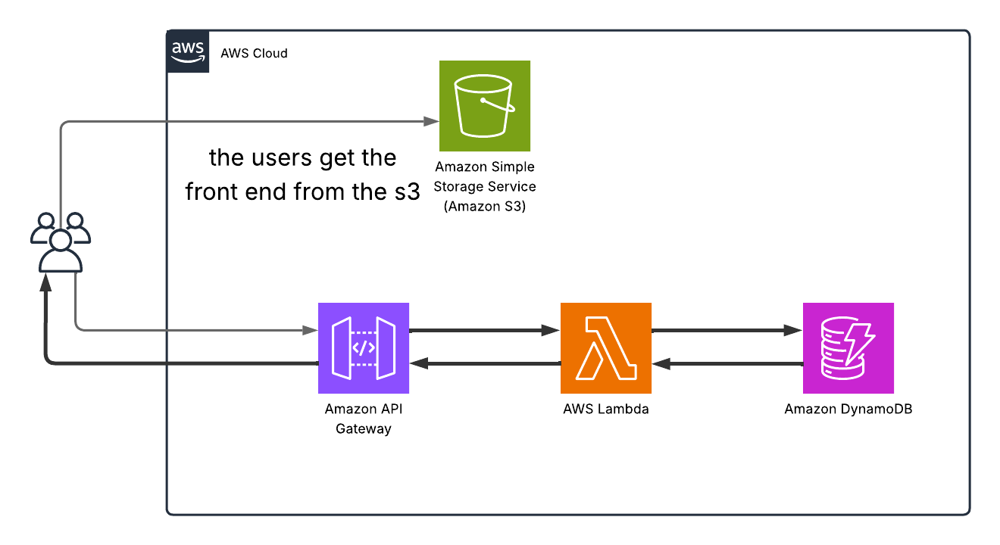

# Serverless ToDo API (Minimal) — AWS SAM
Author: Ayman Aly Mahmoud — ayman@manara.tech
## What this project is
A minimal Serverless REST API that implements CRUD operations for an "items"
collection.
Stack uses:
- API Gateway (HTTP API)
- AWS Lambda (Node.js 18.x)
- Amazon DynamoDB (On-Demand)
This repo contains a SAM template to deploy everything with `sam deploy`.
## Files
- `template.yaml` — SAM template (creates HTTP API, Lambda, DynamoDB)
- `src/index.js` — Lambda handler implementing CRUD
- `frontend/index.html` — optional tiny front-end that calls the API
- `tests/quick-test.sh` — quick test script with `curl` commands
- `iam-policy.json` — example least-privilege policy for Lambda (for review)

# Architecture Diagram

## Prerequisites
- AWS CLI configured (`aws configure`)
- AWS SAM CLI installed
- Docker (only required for building if you add native dependencies; not
required here)

## Deploy (quick)
1. `sam build`
2. `sam deploy --guided`
- Suggested answers:
- Stack Name: `project3-serverless-api`
- AWS Region: (your region)
- Confirm changes: Y
- Allow SAM to create roles: Y
3. After deploy completes, note the `ApiUrl` output.
## Local testing (after deploy)
Edit `tests/quick-test.sh` to replace `<API_BASE>` with the API URL from
outputs (without trailing `/`).
Run:
`bash tests/quick-test.sh`

## How it works (overview)
- The Lambda function listens on `/{proxy+}` for ANY method and parses the
path.
- Supported routes:
- `GET /items` — list all items (DynamoDB Scan)
- `GET /items/{id}` — get one item (GetItem)
- `POST /items` — create an item (expects `id` in payload)
- `PUT /items/{id}` — update an item
- `DELETE /items/{id}` — delete an item
## Notes
- DynamoDB is set to **On-Demand** billing to avoid capacity tuning.
- IAM permissions are minimal and scoped to the table.
- CORS header `Access-Control-Allow-Origin: *` is set for demo; narrow this
in production.
## Host frontend on S3
- Upload `frontend/index.html` to an S3 bucket, enable static website hosting
or serve from CloudFront.
- Set the API URL in the frontend JS.
